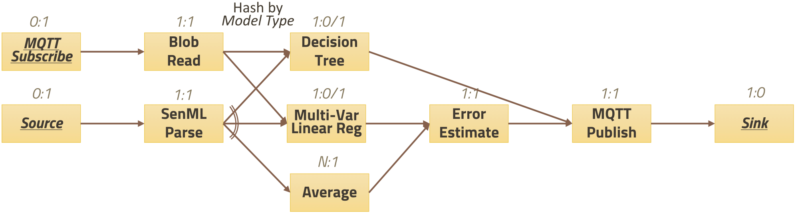
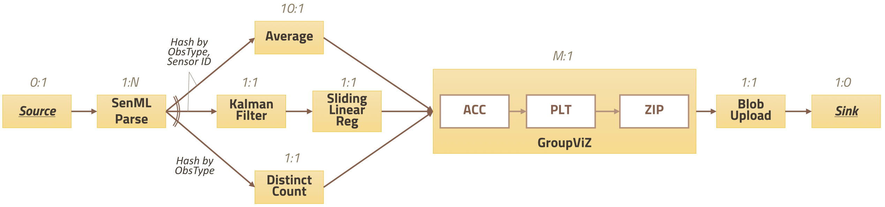
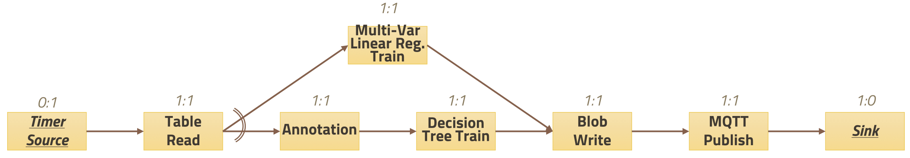
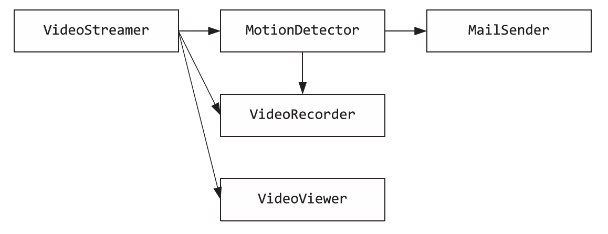

# Benchmarks

## RIoTBench-PRED



-   From [dream-lab/riot-bench](https://github.com/dream-lab/riot-bench#statistical-summarization-dataflow-stats)

### OneOS-DSL Expression

```
cd /ubc/bench-pred

spawn BlobRead.js as "Reader"						// Creates spawned node, adds to "Reader" node group
node DecisionTree.js as "DecisionTree"				// Creates staged node, adds to "DecisionTree" node group
3 * (node LinearReg.js #LargeCPU as "LinearReg")	// Creates 3 staged nodes that need to run on devices with the #LargeCPU attribute, adds them to "LinearReg" node group
node MQTTPub.js as "Publisher"

connect [
	node MQTTSub.js ~> Reader,
	Reader ~> DecisionTree,
	Reader -> LinearReg,							// "->" = pool processing

	node Source.js ~> node Parse.js as "Parse",
	Parse ~> [DecisionTree, node Average.js as "Avg"],
	Parse -> LinearReg,

	[LinearReg, Avg] ~> node ErrorEstimate.js #LargeMem ~> Publisher
	DecisionTree ~> Publisher
	Publisher ~> node Sink.js
] as "ML-PRED"

spawn "ML-PRED"										// Spawns all staged nodes in the graph

2 * (spawn LinearReg.js #LargeCPU as "LinearReg")	// Adds 2 more running node to the "LinearReg" node group
```

### Resulting Graph ("ML_PRED")

```
"ML-PRED":
MQTTSub.js ~> BlobRead.js
BlobRead.js ~> DecisionTree.js
BlobRead.js -> LinearReg.js #LargeCPU
BlobRead.js -> LinearReg.js #LargeCPU
BlobRead.js -> LinearReg.js #LargeCPU
Source.js ~> Parse.js
Parse.js ~> DecisionTree.js
Parse.js ~> Average.js
Parse.js -> LinearReg.js #LargeCPU
Parse.js -> LinearReg.js #LargeCPU
Parse.js -> LinearReg.js #LargeCPU
LinearReg.js #LargeCPU ~> ErrorEstimate.js #LargeMem
LinearReg.js #LargeCPU ~> ErrorEstimate.js #LargeMem
LinearReg.js #LargeCPU ~> ErrorEstimate.js #LargeMem
Average.js ~> ErrorEstimate.js #LargeMem
ErrorEstimate.js #LargeMem ~> MQTTPub.js
MQTTPub.js ~> Sink.js
DecisionTree.js ~> MQTTPub.js
```

### Resulting Node Groups

```
"Reader":
BlobRead.js

"DecisionTree":
DecisionTree.js

"LinearReg":
LinearReg.js #LargeCPU
LinearReg.js #LargeCPU
LinearReg.js #LargeCPU

"Publisher":
MQTTPub.js

"Parse":
Parse.js

"Avg":
Average.js

"ErrEst":
ErrorEstimate.js #LargeMem

"Sink":
Sink.js
```

## RIoTBench-ETL


-   From [dream-lab/riot-bench](https://github.com/dream-lab/riot-bench#extraction-transform-and-load--dataflow-etl)

### OneOS-DSL Expression

```
cd /ubc/bench-etl

spawn Source.js ~> spawn SenMLParse.js ~> spawn RangeFilter.js ~>
spawn BloomFilter.js ~> spawn Interpolate.js ~> spawn Join.js ~>
spawn Annotate.js ~> spawn CsvToSenML.js ~> spawn Sink.js
```

### Resulting Graph

```
Source.js ~> SenMLParse.js
SenMLParse.js ~> RangeFilter.js
RangeFilter.js ~> BloomFilter.js
BloomFilter.js ~> Interpolate.js
Interpolate.js ~> Join.js
Join.js ~> Annotate.js
Annotate.js ~> CsvToSenML.js
CsvToSenML.js ~> Sink.js
```

## RIoTBench-STATS



-   From [dream-lab/riot-bench](https://github.com/dream-lab/riot-bench#statistical-summarization-dataflow-stats)

## OneOS-DSL Expression

```
cd /ubc/bench-stats

spawn Source.js ~> spawn SenMLParse.js ~>
[
	spawn Average.js,
	(spawn KalmanFilter.js ~> spawn SlidingLinearReg.js),
	spawn DistinctCount.js
] ~>
spawn GroupViz.js ~> spawn Sink.js
```

### Resulting Graph

```
Source.js ~> SenMLParse.js
KalmanFilter.js ~> SlidingLinearReg.js
SenMLParse.js ~> Average.js
SenMLParse.js ~> SlidingLinearReg.js
SenMLParse.js ~> DistinctCount.js
Average.js ~> GroupViz.js
SlidingLinearReg.js ~> GroupViz.js
DistinctCount.js ~> GroupViz.js
GroupViz.js ~> Sink.js
```

## RIoTBench-TRAIN



-   From [dream-lab/riot-bench](https://github.com/dream-lab/riot-bench#model-training-dataflow-train)

##OneOS-DSL Expression

```
cd /ubc/bench-train

spawn Source.js ~> spawn TableRead.js ~>
[
	spawn MultiVarLinearRegTrain.js,
	(spawn Annotate.js ~> spawn DecisionTreeTrain.js)
] ~>
spawn BlobWrite.js ~> spawn MQTTPublish.js ~> spawn Sink.js
```

### Resulting Graph

```
Source.js ~> TableRead.js
Annotate.js ~> DecisionTreeTrain.js
TableRead.js ~> MultiVarLinearRegTrain.js
TableRead.js ~> DecisionTreeTrain.js
MultiVarLinearRegTrain.js ~> BlobWrite.js
DecisionTreeTrain.js ~> BlobWrite.js
BlobWrite.js ~> MQTTPublish.js
MQTTPublish.js ~> Sink.js
```

## Video Surveillance



## OneOS-DSL Expression

```
cd /ubc/bench-surveillance

spawn VideoStreamer.js as "streamer"
connect [
	streamer ~>
        [spawn MotionDetector.js ~>
            [
                spawn MailSender.js,
                spawn VideoRecorder.js as "recorder"
            ],
        recorder,
        spawn VideoViewer.js
    ]
] as "VideoStreamGraph"

spawn "VideoStreamGraph"
```

or

```
cd /ubc/bench-surveillance

spawn VideoStreamer.js ~>
[
	spawn MotionDetector.js ~>
	[
		spawn MailSender.js,
		spawn VideoRecorder.js as "recorder"
	],
	recorder,
	spawn VideoViewer.js
]
```

### Resulting Graph

### Resulting Node Groups
