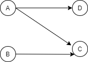

# OneOS Syntax and Semantics

## Terminology
### Nodes
Nodes are related to processes. A node contains all the information needed to spawn a single process in the runtime (e.g. script, args, and tags).

#### Staged Node
A staged node is created with the *node* command. A staged node contains all the information needed to create a process in the runtime, but the process hasn't been spawned (aka created) yet.

#### Spawned Node
A spawned node is created with the *spawn* command. A spawned node contains all the information needed to create a process in the runtime and the process has been spawned.

### Node Groups
Node Groups are named collections of one or more nodes. Grouping nodes under names makes creating a graph with the *connect* command easy. Nodes automatically inherit any edges to or from the Node Group.

### Edges
An edge is a one-way communication channel between any combination of two Nodes or NodeGroups.

### Graph
A collection of edges. Graphs can be created by linking *spawn* commands with pipes or using the *connect* command.

## Supported Bash-Like Commands
- ls
- ps
- cd
- pwd

I think continuing to base the language on Bash syntax makes sense. People using OneOS will almost certainly be familiar with Bash basics so I don't see any benefit in creating new syntax for common commands.

## ls_pipes
Prints list of all pipes in the runtime.

## Lists
Lists are supported using JavaScript-style syntax:

```
[item1, item2, item3, ...]
```

## Repeating Commands
To easily execute the same command *x* number of times, a multiplier may be specified. This is the most obviously useful for spawning multiple processes of the same type.

<pre>
x * (cmd)
</pre>

> Note: This syntax needs to be revised to disambiguate arithmetic ops if they are added to the DSL.

## Spawn
The *spawn* command will be used to start processes immediately. It can be used to spawn a new process or spawn a Node Group or Graph. Spawning a Node Group or Graph means all staged nodes within the group or graph are spawned.

## Spawning a New Process
<pre>
spawn <i>script(s)</i> [args] [tags] [as <i>name</i>]
</pre>

### Args
The arguments to the script.

### Tags
Tags are used to identify the devices the process can be spawned on. The process will only be spawned on devices with matching tags.

#### Unnamed Tags
Unnamed tags are identified with a "#" prefix.

Example:
```
spawn logger.js gpio1.log #webcam #temperature-sensor

```

#### Named Tags (TBD)
<pre>
--name=<i>value</i>
</pre>

Example:
```
spawn logger.js gpio1.log --region=vancouver
```

### Spawning Identical Processes
<pre>
x * (spawn [options] <i>script(s)</i> [args] [as name])
</pre>

Example:

```
10 * (spawn map.js)
```

## Spawning a Node Group or Graph
Processes for all staged nodes within the graph or node group will be created.

<pre>
spawn <i>graph_or_group_name</i>
</pre>


## Node
The *node* command has the same syntax as *spawn* and creates a staged node that can be later "spawned" to start a process in the runtime. A node must be part of a Node Group (i.e. "as *name*") or a Graph created with the *connect* command. The node will be spawned when its associated group or graph is spawned.

<pre>
node <i>script(s)</i> [args] [tags] [as <i>name</i>]
</pre>


## <a name="Piping"></a> Piping
*sender*: a process outputting data to one or more pipes

*receiver*: a process receiving data from one or more pipes

### One-to-One
```
sender ~> receiver

or

sender -> receiver
```

### Replicate
Data sent by the sender is replicated and sent to every receiver.

```
sender ~> [receivers]
```

### Join
Data from all senders is sent to the receiver.

```
[senders] ~> receiver
```

### Split (TBD)
Data is split into a number of chunks equaling the number of receivers. Each receiver receives one of the chunks.

TODO: ordering semantics

```
sender ~/> [receivers]
```

### Merge (TBD)
Data from all senders is merged together before being forwarded to the receiver.

TODO: ordering semantics

```
[senders] ~*> receiver
```


### Pool Processing (TBD)
Data from each sender is sent to any one of the receivers. For now, let's assume load balancing is attempted through round robin message passing by all senders. More complex load balancing may be required.

```
[sender(s)] -> [receivers]
```

### Many-to-Many: Replicate/Join
All data from all senders is replicated and received by every receiver.

```
[senders] ~> [receivers]
```

### Many-to-Many: Split + Join (TBD)
Data from each sender is split into a number of chunks equaling the number of receivers. Each sender individually splits the chunks among the receivers.

```
[senders] ~/> [receivers]
```

### Many-to-Many: Merge + Replication (TBD)
Data from all senders is merged together, replicated, and sent to every receiver.

```
[senders] ~*> [receivers]
```

### Many-to-Many: Join + Pool Processing (TBD)
Data from all senders is merged together before being forwarded to one of the receivers.

```
[senders] -*> [receivers]
```

### Pipe Throughput Constraints (TBD)
Ensures no more than the specified bytes per second are leaving or entering a process at a time.

```
~>{<bytes/second>}
~/>{<bytes/second>}
~*>{<bytes/second>}
->{<bytes/second>}
-*>{<bytes/second>}
```

Example:
```
spawn gpio-reader.js /dev/gpio1 ~>{10} spawn logger.js gpio1.log
```

*Kumseok:* What do you think about supporting constraints in a generic way? For example, it would be something like binding a boolean function to a stream, essentially telling the system to ensure that the function always returns true.

Example: 
```
function qos5mbs () {
	return bytes/second >= 5
}

A ~>{qos5mbs} B
```

### Creating Pipes
Pipes can be specified between processes as they are spawned or within the list of edges argument of the *connect* command (see next section).

Example:
```
10 * (spawn map.js) -> 4 * (spawn reduce.js) ~> spawn reduce.js log.txt
```

## Connect
The *connect* command provides a straightforward way to create graphs. See [Piping](#Piping) for the types of pipes available.

<pre>
connect <i>list_of_edges</i> as <i>name</i>
</pre>

For example, the following simple graph cannot be specified by strictly linking spawn commands with pipe operators:



To solve this, we need create Node Groups that can be referenced multiple times in the list of edges:
```
spawn program_A.js as "A"
spawn program_C.js as "C"

connect [A ~> C, A ~> spawn program_D.js, spawn program_B.js ~> C]
```

Other examples of valid syntax, except A consists of two processes in these cases:
```

spawn program_A.js as "A"
node program_A2.js log.txt as "A"
node program_C.js as "C"

connect [A ~> C, A ~> node program_D.js, node program_B.js ~> C] as "graph_A"
spawn "graphA"

or

spawn program_A.js as "A"
node program_A2.js log.txt as "A"
node program_C.js as "C"
node program_D.js as "D"
node program_B as "B"

connect [A ~> C, A ~> D, B ~> C] as "graph_A"

spawn "A" // will spawn the staged process and do nothing to the already running process in the "A" node group
spawn "B"
spawn "C"
spawn "D"
```

```
// To add a few more processes to the Graph that send to C and D, we can spawn more processes
// under the Node Group "A" since the new processes automatically inherit the group's edges.
3 * (spawn program_A.js as "A")
```

## Spawn Connect (TBD)
The *spawn_connect* command is identical to the *connect* command except the graph is immediately spawned so it doesn't require a name.
<pre>
spawn_connect <i>list_of_edges</i>
</pre>

Example:
```
spawn program_A.js as "A"
node program_A2.js log.txt as "A"
node program_C.js as "C"

spawn_connect [A ~> C, A ~> node program_D.js, node program_B.js ~> C]
```

## Other Language Elements
These other elements have been briefly brought during discussions:

- Programming language elements:
    - Variables
    - Functions
    - Objects
    - Loops
- A "Job" abstraction.
    - A group of processes performing a task could be grouped into a "job". OneOS user's could then potentially monitor and manage graphs rather than processes.
    - Creates a clear separation between graphs.

The language currently described in this document only consists of individual commands. Kumseok has mentioned he has had to use richer programming language features like functions and objects to support the actions he needed to do.